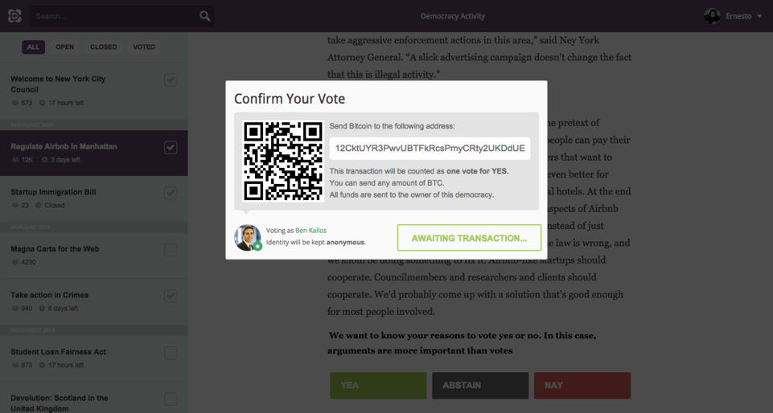
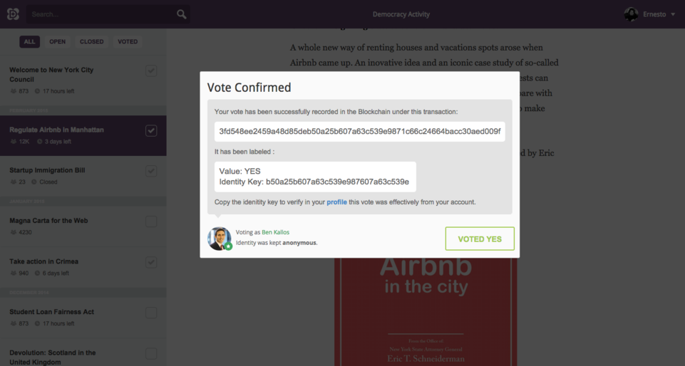

# Votechains

> Motivating democracy. Unstoppable.

## Abstract

***Draft***

## Motivation

***Draft***

## Related Projects

Below is a short overview of existing research, organizations and implementations of blockchain based democracy applications.

### Propose and Vote

Voting is a key functionality of blockchain technology. The underlying consensus protocols on most distritubted peer-to-peer solutions always have to include ways to update protocols and restore consensus upon disputes. A prominent example is the Bitcoin Improvement Proposal [BIP0034](https://github.com/bitcoin/bips/blob/master/bip-0034.mediawiki#Specification), of the infamous crypto-currency [Bitcoin](http://bitcoin.org), proposing miner behaviour on softforking mechanics.

This is voting on a very technical level and not considered part of this whitepaper.

The following projects rather focus on applications on top of blockchains, enabling democratic participation in any kind of groups or societies.

[DemocracyOS](http://democracyos.org/) is a web-application from Argentina which allows you to propose, debate and vote online. The team discussed blockchain integration back in 2015 [once](http://blog.democracyos.org/post/114076491913/blockchain-support-for-democracyos-we-want-to-add) and [twice](http://blog.democracyos.org/post/122357355613/were-making-a-live-hangout-to-talk-decentralized). An article on Newschallange contains first [mockups](https://www.newschallenge.org/challenge/elections/entries/blockchain-support-for-open-source-platform-democracyos).

[Democracy.earth](http://democracy.earth/) is a follow-up project by [Santiago Siri](https://www.youtube.com/watch?v=eOYcaRWMbyE) and [Pia Mancini](https://www.ted.com/talks/pia_mancini_how_to_upgrade_democracy_for_the_internet_era) from DemocracyOS who relocated to the United States recently. The project is currently creating a community, recruiting enthusiasts and researching on blockchain voting and identity.

[Follow My Vote](https://followmyvote.com/), formerly 'Vote DAC' ([PDF](https://followmyvote.com/wp-content/uploads/2014/08/The-Key-To-Unlocking-The-Black-Box-Follow-My-Vote.pdf)) is a distributed autonomous company (DAC) emerged from the  [Bitshares community](https://bitsharestalk.org/index.php?board=63.0). It's currenlty [heavily developing](https://github.com/FollowMyVote/StakeWeightedVoting/) a stake-weighted blockchain voting DAC by a team around [Adam Kaleb Ernest](https://www.youtube.com/watch?v=TQMoKiP5q7Y).

[Public Votes](http://publicvotes.org/) is an [Ethereum](http://ethereum.org) voting application designed and implemented by [Dominik Schiener](https://medium.com/@DomSchiener). Both his [proposal](http://schiener.me/2015/openvotes-voting/) and more recent [analytics](http://schiener.me/2015/voting-on-ethereum-analysis/) are highlighting advantages and issues arising with Ethereum and blockchain voting. The source code is available on [Github](https://github.com/domschiener/publicvotes).

In 2014 [Jesper Borgstrup](https://jesper.borgstrup.dk/2015/01/masters-thesis-private-trustless-decentralized-message-consensus-voting-schemes/) wrote a master thesis on 'Private, trustless and decentralized message consensus and voting schemes' ([PDF](https://jesper.borgstrup.dk/master-thesis-report.pdf)). The protocol uses blockchain-technology and invertible bloom lookup tables for defining deadlines and timestamping of messages. Linkable ring signatures provide a scheme suitable for signing votes. Source code is available on [Github](https://github.com/jesperborgstrup/PyBitmessageVote).

[BitVote](http://bitvote.net) is an Ethereum decentralized application (DApp) using encryption chains and a peer-to-peer hybrid technology for the purpose of proposal collaboration, information sharing and voting. There is a whitepaper [draft](https://github.com/arkbg1/BitVote/wiki/*A*-plan), a [video](https://www.youtube.com/watch?v=z-BtgF3oqoA) and a first [demo](https://bitvote.github.io/) available.

Developed by France's netparty, [Nemos.io](http://nemos.io/) is a blockchain-proofed decision making tool based on Ethereum with eleminated gas costs. The source is available on [Github](https://github.com/netparty-france/nemos.io/).

The [Blockchain Apparatus](http://blockchainapparatus.com/voting/) aims to become a blockchain-secured voting machine.

Students from the West Virginia University WVU, [Ricky Kirkendall](https://twitter.com/clickycrocodile) and [Ankur Kumar](https://twitter.com/ankurkwv), are [currently](http://www.thedaonline.com/news/article_c23dd902-8e7c-11e5-881d-db3cafa77e63.html) [creating](http://www.coindesk.com/west-virginia-university-student-government-blockchain-voting/) SureVoting, a student government voting app for iPads. There is no concept or code released yet.

[Votecoin](https://votecoin.wordpress.com) is a proposal for a hash based voting technology. The [whitepaper](https://votecoin.wordpress.com/about/) calls for a fair, transparent, practical solution but fails to deliver details.

(Vote)&sup2; emerged from the ether camp [hackathon](http://quadraticvoting.on.ether.camp/ide.html) in december 2015 and developed a quadratic voting dapp based on the Ethereum network. Checkout the demo [video](https://www.youtube.com/watch?v=xz9dGRs7FOQ).

[AgoraVoting](https://agoravoting.com/) had the [idea](https://blog.agoravoting.org/index.php/2013/11/28/a-bitcoin-based-completely-distributed-voting-system/) to add a distributed voting system on top their working solutions but [failed](https://blockchain.info/address/1EwqtN6GwHmkfYEfxGhuVcjrNBdQwvXMd3) to crowdfund the development.

[BitCongress](http://www.bitcongress.org/) claims to be a decentralized voting platform but is lacking references or source code, a [whitepaper](http://www.bitcongress.org/BitCongressWhitepaper.pdf) is available though.

[V-Initiative](http://www.v-initiative.org/) proposed a decentralized voting app but the project seems [dead](http://v-app.io/landing) already.

The team for [Appstimmung](http://appstimmung.de/) wants to provide a blueprint for a better democratic process and develop blockchain based tools which educate, inform, support the decision making. This whitepaper is initialized by them and tries to connect the projects above by promoting an improved cross-initiatives collaboration. Browse the repositories on [Github](https://github.com/VotesApp).

### Identity and Authentication

***Draft***

* Schiener, Dominik (2015): A new Identity Model with Prototype [blog](http://composui.com/2015/09/08/a-treatise-on-identity-part-2-a-new-identity-model-with-prototype/)
* [Onename](https://onename.com/), blockchain id
* [ShoCard](http://www.shocard.com/), blockchain identity card
* [EtherID](http://etherid.org/), the Ethereum name registry: [source code](https://github.com/lexansoft/EtherID.org)
* [Proof-of-Individuality](http://proofofindividuality.tk/) anti-sybil token: [source code](https://github.com/d11e9/poi)
* [EtherReal](http://etherre.al/wp/), trustless proof of personal identity

### Storage

***Draft***

* [Storj](http://storj.io/) decentralized blockchain cloud storage
* [IPFS](https://ipfs.io/) peer-to-peer hypermedia protocol
* [SAFE Network](https://safenetwork.org/), a peer-to-peer data storage network
* [Swarm](https://github.com/ethereum/go-ethereum/wiki/Swarm---distributed-preimage-archive) distributed preimage archive
* [Sia](http://sia.tech/) distributed collaborative data storage by managed smart contracts
* [Filecoin](http://filecoin.io/) data storage network based on bitcoin: [whitepaper](http://filecoin.io/filecoin.pdf)
* [Eris](https://erisindustries.com/) distributed file storage services by smart contracts

## Target Issues

## Proposed Solutions

## Outlook

## Contribute

Issues can directly be raised on here on [Github](https://github.com/VotesApp/whitepaper/issues), refer the related section and explain in detail how the paper can be improved.

Corrections and suggestions can be directly contributed via [pull requests](https://github.com/VotesApp/whitepaper/pulls).

Contributors can add their contact details to the list of [authors](AUTHORS.md).

## License

This paper is available in the [public domain](LICENSE.md).
